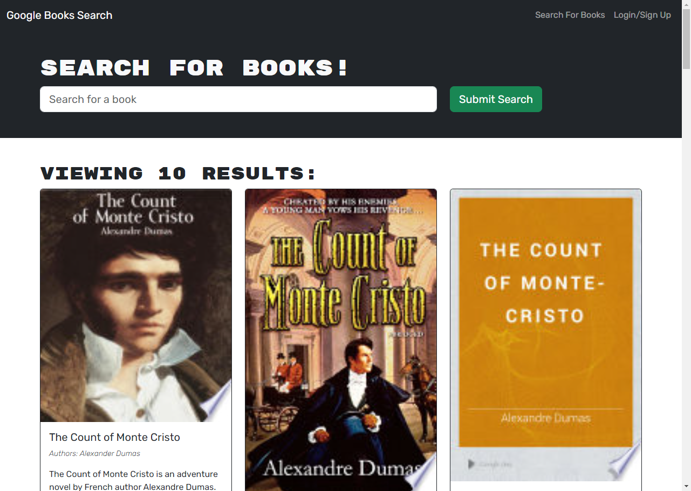

# Book Search Engine

This web app allows users to search for new books and maintain a running 'to-read' list.

Although originally created with a RESTful API, the code was refactored to have a GraphQL API with an Apollo Server. 

## Usage

The website can be accessed [here](https://book-search-engine-ibbw.onrender.com).

A preview can be seen below.

.

## Contributions

The starter code for this project was accessed [here](https://github.com/coding-boot-camp/solid-broccoli), initially created by [Xandromus](https://github.com/Xandromus).